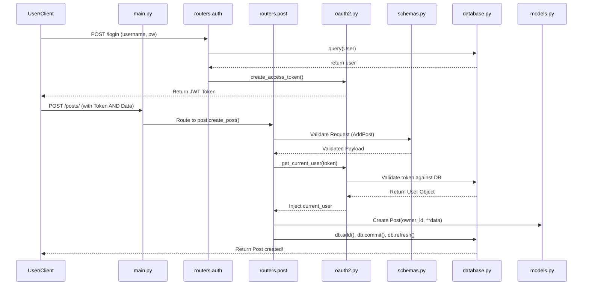
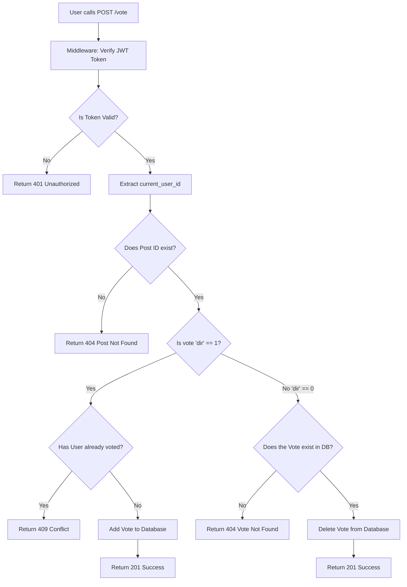

# Architecture and Code Flow Guide

This document maps out the specific execution flow to help you navigate how exactly the files communicate and what functions are executed at what timeline.

## 🤝 1. Sequence Diagram: Authentication & POST Creation
*How do files link up when a user creates a new post?*

---

## 🗺️ 2. Walkthrough and Map of Code Flow in Every File
If you were to trace the lifecycle of the code, this is how you understand the core files:

- **`app/main.py`**: The Orchestrator. When Uvicorn starts the app, it hits `main.py` first. `main.py` doesn't do business logic; it acts as the gateway. It imports the routers (`post.router`, `user.router`, `auth.router`) and binds them to the API.
- **`app/config.py`**: The Foundation. Fast API starts, it reads `config.py` immediately to parse your `.env` variables ensuring safe secret key handling and DB connections.
- **`app/database.py`**: The Connection Pipeline. Used by routers, it initiates a connection to Postgres via SQLAlchemy. Every time an API endpoint is hit, the `get_db()` function yields a temporary database session specifically for that request.
- **`app/models.py`**: The DB Translator. Defines the physical layout of your SQL tables. Used extensively by `database.py` and routers during queries to know what data exists.
- **`app/schemas.py`**: The Bouncer. Defines what JSON data is allowed into the API, and what JSON data is emitted out. This prevents malicious payloads from hitting your database.
- **`app/routers/*.py`**: The Workers. These act as mini `main.py` chunks. When an API call comes in, `main.py` passes the torch to a corresponding router. From here:
    1. Dependencies trigger (`oauth2` logic checks Token, `database.py` opens DB pipeline).
    2. Logic executes.
    3. `schemas.py` formats response to JSON -> returned to User.

---

## 🔀 3. Flowchart for Functions (Voting Logic Example)
*How does the voting algorithm process a user's request?*

## 📝 Summary: How to Understand the Code Flow

1. **Incoming Request**: A client sends JSON.
2. **Gateway**: `main.py` intercepts route and passes to appropriate `router`.
3. **Guardrails**: FastAPI immediately checks type parameters based on `schemas.py`, and checks Authentication based on `oauth2.py`.
4. **Execution**: The router opens a session to `database.py` and executes a query using objects structured by `models.py`.
5. **Outgoing Response**: Validated by `schemas.py` and returned as a JSON sequence.
